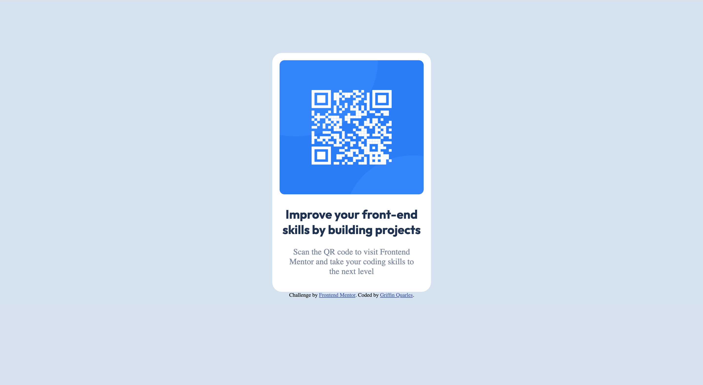

# Frontend Mentor - QR code component solution

This is a solution to the [QR code component challenge on Frontend Mentor](https://www.frontendmentor.io/challenges/qr-code-component-iux_sIO_H). Frontend Mentor challenges help you improve your coding skills by building realistic projects. 

## Table of contents

- [Overview](#overview)
  - [Screenshot](#screenshot)
  - [Links](#links)
- [My process](#my-process)
  - [Built with](#built-with)
  - [Continued development](#continued-development)
- [Author](#author)

## Overview
This was my first frontendmentor project and just getting used to the layout and how everything works.
It was a good entry project.
### Screenshot

### Links

- Solution URL: [Add solution URL here](https://github.com/gsquarles/qrCode.git)
- Live Site URL: [Add live site URL here](https://gsquarles.github.io/qrCode/)

## My process
This took me about an hour to create just using a mix of flexbox to align items and some grid as well to center things.
It was a good beginner project to help me practice recreating the item.  I wish it didn't take as long as it did
but nonetheless it was good practice.
### Built with

- Semantic HTML5 markup
- CSS custom properties
- Flexbox
- CSS Grid
### Continued development

I would like to be able to create something like this in about 15 minutes or so.  And not using a weird mixture of
grid to Center things and flexbox in another.  I feel if I was truly proficient in flexbox I could of easily made the whole
thing with only that.

## Author

- Website - [Griffin Quarles]
- Frontend Mentor - [@gsquarles](https://www.frontendmentor.io/profile/gsquarles)
